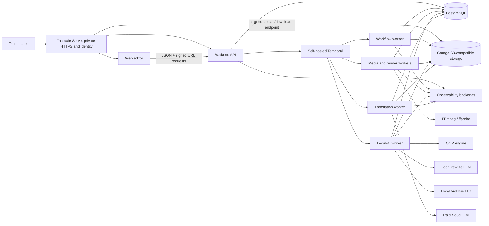

# Architecture

## Architectural style

Use a modular monorepo and a modular monolith with three independently runnable process types: web, API, and workers. Logical modules communicate in process through application interfaces. PostgreSQL, object storage, and Temporal are shared infrastructure; this does not make each module a product service. The first deployment is a single owner-operated host, not a public cloud environment.

## System context

All nodes except the cloud translation LLM run on the local host or its container VM. Tailscale Funnel is disabled. Application and infrastructure ports bind to loopback or a private container network; only explicit Tailscale Serve listeners are reachable from the tailnet.

## Runtime responsibilities

- **Web:** project UI, upload coordination, tone selection, transcript/glossary/translation review, structured subtitle-style controls, proxy playback, HTML subtitle overlays, audio preview, status updates, and download initiation. It never performs authoritative rendering.
- **API:** authentication/authorization, project commands and queries, signed URL issuance, optimistic edit concurrency, workflow admission/cancellation, quota checks, and status/event projection.
- **Temporal workflows:** durable orchestration, human-review waits, bounded retries, timers, cancellation, compensation/cleanup scheduling, and recovery after worker restarts.
- **Workers:** stateless execution around durable inputs. Workflow, media, render, local-AI, and translation queue profiles isolate CPU/memory/temp-disk pressure and credentials. Only the translation profile has the paid LLM credential and provider egress.
- **PostgreSQL:** projects, editorial state, versions, workflow/stage history, idempotency records, review tasks, quotas, cost ledger, and artifact metadata. It does not hold large media blobs.
- **Object storage:** immutable originals, proxies, frames/batches where retained, OCR payloads, subtitle documents, prompt/response envelopes, TTS attempts, render inputs, outputs, and validation reports.

## Logical modules

| Module | Owns | Does not own |
|---|---|---|
| Identity & access | user identity mapping, ownership policy | provider login UI internals |
| Projects | lifecycle, settings, edit versions | media processing |
| Media | probe metadata, proxies, subtitle-region extraction | OCR interpretation |
| Transcript | stable segments, source revisions, review | provider timestamps |
| Context | entities, relationships, glossary, ambiguity review | translation batches |
| Translation | tone-prompt catalog, translation-policy versions, batch planning, validated translations, consistency | source timestamps or arbitrary user prompts |
| Speech | TTS attempts, measured duration, fitting policy | main translation |
| Rendering | subtitle-style versions, approved font catalog, render manifests, FFmpeg/libass execution, output validation | browser preview state or raw user CSS/ASS |
| Workflow | orchestration, executions, retries, cancellation | domain decision rules |
| Artifacts | immutable metadata, lineage, retention | business status |
| Usage | quota reservation, token/audio/compute cost ledger | vendor billing truth |

## Proposed technology stack

| Area | Proposal and fit | Realistic alternatives and trade-off | Reversibility |
|---|---|---|---|
| Web | Next.js, React, TypeScript; productive authenticated editor, SSR where useful, broad testing support | Vite SPA is simpler but needs separate routing/server choices; SvelteKit is smaller but has a narrower hiring/ecosystem pool | Medium |
| API | Python (3.12 baseline proposed) with FastAPI and Pydantic; aligns with OCR/media/LLM ecosystem and typed OpenAPI | Django offers more built-ins but stronger framework coupling; Node/NestJS unifies languages but makes Python-heavy workers less direct. Final Python minor must satisfy every native adapter on arm64/amd64 | Medium |
| Workflows | Self-hosted Temporal with Python SDK and PostgreSQL persistence; durable histories, timers, cancellation, signals, retries, and restart recovery match long human-in-loop flows without a SaaS fee | Celery/Dramatiq plus custom state uses fewer containers but shifts durability/idempotency burden into the app. Temporal has higher memory and operational cost | Difficult |
| Workers | Same Python application package, separate Temporal task queues and process entry points for workflow, media, render, local AI, and paid translation | Fewer profiles are simpler but would expose the paid key/network to unrelated OCR/TTS/rewrite work; separate services are unnecessary | Easy initially |
| Database | Self-hosted PostgreSQL on a persistent host volume, with separate application and Temporal databases/credentials in one server | SQLite reduces operations but is unsuitable for concurrent application and durable workflow state; a managed database is an optional future reliability upgrade | Difficult |
| Data access | SQLAlchemy 2 async repositories plus Alembic | Django ORM increases framework coupling; SQLModel is concise but less explicit for complex persistence boundaries | Medium |
| Object storage | Garage S3-compatible storage on persistent host storage, with a tailnet-only signed-URL endpoint and an independent backup target | MinIO is now source-only and its upstream repository is archived; plain filesystem storage violates the object-storage boundary. Garage single-node has no redundancy | Medium |
| Authentication | Tailscale Serve identity headers plus an exact owner allowlist mapped to an internal user ID; trust headers only from the loopback Serve proxy | `tsidp` OIDC is the upgrade for multiple users or conventional sessions; a separate IdP adds unnecessary MVP operations | Medium |
| Contracts | Pydantic request/response schemas, OpenAPI, generated TypeScript client, JSON Schema for provider outputs | tRPC lacks a natural Python boundary; hand-written clients drift | Easy |
| OCR | FFmpeg extraction plus RapidOCR/ONNX Runtime as the first Apple-Silicon-friendly evaluation target; Chinese models and offline execution | PaddleOCR is the accuracy/reference alternative but its PaddlePaddle runtime may require a local arm64 source build on macOS; cloud vision may improve accuracy at recurring cost/privacy impact | Easy behind port |
| Cloud LLM | Provider-neutral structured-output adapter; OpenAI proposed first, with pinned model/prompt identifiers and recorded usage | Anthropic or Google can implement the same contract; portability is limited by prompt behavior, so contract tests matter | Medium |
| Local rewrite | llama.cpp HTTP server with a pinned Vietnamese-capable GGUF model and Metal on Apple Silicon | MLX is highly optimized on Mac but less portable; Ollama is convenient but adds another abstraction | Easy behind port |
| TTS | VieNeu-TTS v3 Turbo through its local ONNX CPU path, using a pinned built-in preset voice and no voice cloning; it is Vietnamese-specific, offline, Apache-2.0-labelled, and designed for Apple Silicon/CPU use | VieNeu v2 CPU is the fallback if v3 early-access stability fails, but uses an older 24 kHz path. Piper failed the owner's listening test. Chatterbox v3 documents Vietnamese as not production quality, Vietnamese F5 weights reviewed so far are non-commercial, and cloud TTS violates the paid-translation-only constraint | Easy behind port; model behavior is medium |
| Media | Version-pinned FFmpeg/ffprobe with libass subtitle rendering, invoked through a hardened process runner and explicit font assets | GStreamer is powerful but increases pipeline complexity; library wrappers still rely on FFmpeg behavior | Medium |
| Observability | OpenTelemetry instrumentation, structured JSON logs, Prometheus, Grafana, and Jaeger locally; start with short retention and omit Loki until log volume justifies it | SaaS observability reduces maintenance but adds recurring cost; a larger local stack consumes memory | Easy/medium |
| Testing | pytest, Hypothesis where valuable, Testcontainers, Vitest, Testing Library, Playwright, Schemathesis, and k6 | Other runners are viable; this set spans Python, web, API, and load needs without bespoke harnesses | Easy/medium |
| Local development | macOS host tools plus Compose for PostgreSQL, Temporal, Garage, and application composition roots; `uv`, `pnpm`, lockfiles, and a checked-in task runner | Running everything directly on the host is lighter but less reproducible | Easy |
| CI/CD | Repository-local checks are authoritative; GitHub Actions may use its free allowance, with a self-hosted runner considered only on an isolated node | Fully local checks cost nothing but provide weaker merge enforcement; a runner on the deployment host increases attack and resource risk | Medium |
| Deployment | Docker Compose on an always-on Apple Silicon Mac via Colima or on a Linux host via Docker Engine/Podman; Tailscale Serve supplies private HTTPS and identity. `launchd`/systemd restarts the stack | Public cloud improves availability and scaling but adds recurring cost. A second local node can later separate render/storage without changing modules | Medium |

Exact versions belong in approved manifests and lockfiles, not these planning documents.

## Key request flows

Uploads use a server-created upload intent with size/type constraints and a scoped object key. The browser uploads directly, then calls completion. The server verifies object metadata and schedules independent media validation before accepting it as usable.

For the local deployment, the signed object endpoint is exposed on a dedicated Tailscale Serve HTTPS listener and is reachable only from permitted tailnet users. PostgreSQL, Temporal, Garage administration, metrics, and worker ports are not generally exposed to the tailnet.

Edits use immutable revisions and optimistic concurrency. A new translation or transcript revision invalidates only derived stages whose input fingerprints changed. Final render consumes a frozen render manifest containing exact artifact and revision IDs.

Tone selection is project-wide for the MVP. The API accepts a catalog preset ID, resolves it to an immutable translation-policy version and server-owned prompt template, shows the estimated paid rerun impact, and requires an explicit command before superseding translation outputs. Context extraction stays tone-neutral and reusable. A tone change creates new translation batch executions and invalidates their TTS/duration/render descendants; it does not repeat upload, media, OCR, transcript, or global-context work.

Subtitle appearance is project-wide structured state. The API validates a style object against a small approved font catalog and bounded values. The browser maps that exact style to HTML/CSS over the proxy; the renderer maps it to generated ASS/libass inputs with pinned font artifacts. Raw CSS, ASS override text, FFmpeg fragments, host font names, and arbitrary font URLs are never accepted. A style change creates a new style version and invalidates only render manifests/outputs; it never triggers translation, TTS, or proxy encoding.

## Consistency and transactions

PostgreSQL is the authority for business metadata. Object publication is a two-step protocol: write to a unique staging key, verify checksum/metadata, then transactionally register an immutable artifact as available. A sweeper deletes abandoned staging objects. Temporal activity completion is not treated as the business transaction; activities use idempotency records and reconcile on retry.

## Non-goals

No Kubernetes, Kafka, service mesh, event-sourced aggregate store, multiple application databases, per-stage microservice, GPU requirement, public internet ingress, or real-time video compositing is justified for the MVP.
