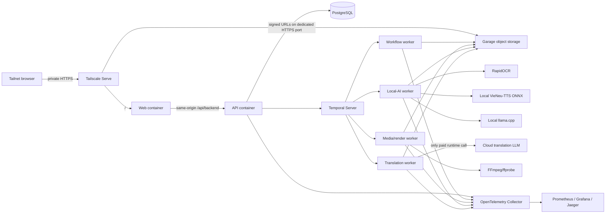

# Deployment strategy

## Decision and cost boundary

The first production-like deployment is a single owner-operated machine reachable only through an existing Tailscale tailnet. All runtime components are free/open-source or covered by Tailscale's personal free plan; the cloud translation LLM is the only paid runtime dependency. Hardware, electricity, storage media, network access, and operator time remain real costs.

This is a personal MVP deployment, not a highly available service. The host being asleep, offline, under maintenance, or failed makes the application unavailable. That is an explicit trade-off, not a hidden production guarantee.

## Host and container runtime

Preferred initial host: an always-on Apple Silicon Mac with sufficient unified memory and a dedicated persistent storage location. Run the application and infrastructure as non-root containers with Docker Compose through Colima. A Linux arm64/amd64 host using Docker Engine or Podman Compose is the compatible alternative.

Tailscale runs on the host, outside the application containers. Application services bind only to `127.0.0.1` or private container networks. `launchd` on macOS or systemd on Linux starts the container runtime, Compose stack, and persistent Tailscale Serve configuration after reboot. Disable automatic sleep while serving.

## Local topology

PostgreSQL hosts separate application and Temporal databases with different credentials. Temporal uses PostgreSQL visibility so Elasticsearch/OpenSearch is not introduced. Garage data and metadata use persistent host volumes. The local rewrite model, VieNeu-TTS model/preset assets, and approved browser/renderer font files are version-pinned, checksummed assets stored outside container writable layers. Release images or read-only asset mounts contain the font catalog; production never reads arbitrary host fonts.

## Tailnet exposure and authentication

- Tailscale Serve terminates private HTTPS at the web origin. Funnel stays disabled.
- The web same-origin gateway receives the Serve identity, forwards only reviewed request headers, and signs its private request to the API with an internal proxy secret. The API trusts identity only from configured web-proxy IPs with that secret.
- A separate Tailscale HTTPS listener may expose the Garage S3 data API for signed browser upload/download. Its admin, metrics, and RPC endpoints remain private.
- PostgreSQL, Temporal gRPC/UI, worker ports, llama.cpp, the VieNeu-TTS runtime, Garage administration, Prometheus, Grafana, Jaeger, and the container runtime socket are not generally exposed.
- Operational UIs are accessed on loopback, through Tailscale SSH, or through a temporary operator-only Serve rule.

If the application becomes commercial or exceeds the Tailscale personal-plan terms, re-evaluate Tailscale licensing or move to a self-hosted control plane plus reviewed application identity. Do not silently depend on a free tier that does not permit the intended use.

## Storage and backup

Single-node Garage provides the required S3-compatible artifact boundary but not redundancy. Its persistent data, PostgreSQL, secrets, model assets, and telemetry must not live only inside container writable layers. Enable full-disk encryption on the host storage (`FileVault` on macOS or LUKS on Linux) and encrypt removable backup media.

Use two backup layers:

1. frequent application-consistent PostgreSQL dumps plus Garage/artifact inventory and configuration snapshots;
2. encrypted, versioned backups to a physically independent disk or NAS using a free tool such as restic or rclone.

A second directory or volume on the same physical disk is not a backup. Define retention, monitor backup age/failure, and perform restore drills that reconcile PostgreSQL artifact metadata with stored object checksums. Keep translation API credentials and backup keys separate.

## Runtime egress and secrets

Only the translation activity worker receives the paid LLM credential and outbound access to the approved provider endpoint. Other runtime containers use local/private networks and no general internet egress where the container runtime permits enforcement. Image, model, voice, and security updates are explicit maintenance actions.

Secrets are mounted from owner-readable files outside the repository or provided through an OS keychain/age-encrypted workflow. They never appear in images, Compose definitions committed to Git, browser bundles, logs, traces, or artifacts.

## Release and rollback

GitHub Actions provides the current continuous-delivery boundary described in [ADR-0014](adr/0014-github-actions-and-ghcr-delivery.md): after all protected-main gates pass, it publishes public GHCR API, web, and worker images for `amd64` and `arm64` with immutable full-SHA tags, provenance, and SBOMs. It does not connect to or deploy the local host. The production Mac must not be a persistent self-hosted runner for this public repository.

1. Select exact full-SHA image tags or recorded digests from one commit; never deploy the movable `main` tags.
2. Run unit, integration, workflow replay, media, API, browser, security, and migration checks without calling the paid LLM.
3. Back up PostgreSQL and configuration; verify Garage/backup health and available disk.
4. Apply backward-compatible expand migrations through a single-run migration task. Never migrate automatically during application startup.
5. Replace containers in dependency order with readiness checks, run a synthetic local transaction, and verify queues, disk, identity, object publication, and telemetry.
6. Roll back to previous immutable images while the database remains backward compatible. Never use destructive down-migration as incident recovery.

Pin provider/prompt/model versions per workflow run. Rollback affects new work and does not rewrite immutable completed artifacts. Temporal changes require workflow versioning and replay tests against open histories.

## Capacity and operations

Start with one active render and conservative OCR/TTS/translation fan-out. Admission uses free disk, memory, temperature/resource pressure, queue age, and translation budget. Rendering and local models compete for unified memory; worker concurrency must be benchmarked on the actual host. VieNeu-TTS initially uses its ONNX CPU path with one synthesis slot. Benchmark both native macOS development and the Linux arm64 Colima container because host claims do not establish container performance; do not switch to a host-only production process merely to hide a failed container benchmark.

Monitor host uptime, sleep state, CPU temperature/load, unified memory, swap, disk capacity, backup age, Garage/PostgreSQL/Temporal health, queue age, translation errors/cost, and review backlog. Storage exhaustion pauses new uploads and expensive stages before corrupting state.

## Environments

- **Development/test:** same Compose topology with synthetic fixtures, fake translation provider, shorter retention, and isolated volumes/databases/bucket.
- **Local production:** pinned images, persistent volumes, real tailnet identity, paid translation credential, off-host backup, and stricter limits.

Do not place development and production data or secrets in the same database, bucket, volumes, or namespace even when they share one physical machine.

## Current implementation boundary

Phase 2 includes a development-only Compose topology for PostgreSQL, Temporal, Garage, one-shot Alembic migration and Garage CORS initialization, and the three non-root application composition roots. API, web, Temporal gRPC, and Garage data ports publish to loopback only; the worker has no inbound application port. The local profile uses committed local-only credentials and development identity, named volumes, provisional limits, and no paid provider.

This is not the production deployment: host Tailscale Serve rules, real secret files/credentials, staging sweepers, deletion, backups, production telemetry, egress restrictions, read-only roots/resource limits, production Compose overrides, and deployment automation remain gated. CI and immutable image delivery are implemented; migrations are separate from application startup and verified through upgrade/downgrade/drift tests.
