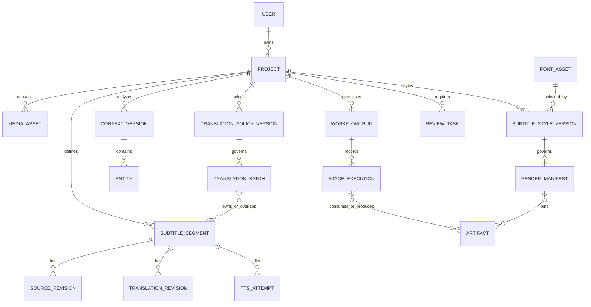

# Domain model

## Identity and versioning

Use UUIDv7 identifiers generated by the backend for sortable, globally unique IDs. A stable identity is distinct from a revision: `subtitle_segment_id` remains constant while transcript and translation revisions are immutable rows. Mutable pointers select the currently approved revision.

All timestamps are UTC instants except media timing, which uses integer microseconds from the probed stream time base. Floating-point seconds are presentation only.

## Aggregates and records

### Project

Owns user authorization scope, title, lifecycle, processing settings, current approved transcript/context/translation-policy/subtitle-style pointers, quota reservations, and deletion state. Project lifecycle is coarse: `draft`, `active`, `completed`, `deletion_pending`, `deleted`. Processing and review state are projections, not an ever-growing project status enum.

### MediaAsset

References the original artifact and verified probe metadata: container, codecs, duration, frame dimensions, streams, rotation, time bases, and safety validation. A project can have replacement input versions, but each workflow pins exactly one.

### SubtitleSegment

Backend-owned stable ID plus authoritative `start_us`, `end_us`, ordinal, optional speaker label, and lineage to OCR evidence. Constraints include `start_us >= 0`, `end_us > start_us`, deterministic ordering, and an explicit overlap policy. Providers receive the ID and timing budget but cannot alter timing.

`SourceRevision` stores Chinese text, origin (`ocr`, `user`, `import`), confidence, editor, and created time. `TranslationRevision` stores Vietnamese text, origin (`cloud_translation`, `consistency_repair`, `duration_rewrite`, `user`), context/translation-policy/tone/prompt/model identifiers, and its parent revision.

### ContextVersion and Entity

A context version is immutable and derived from an exact transcript version. It holds the global summary and entities. Each entity has type, Chinese forms, aliases, preferred Vietnamese rendering, confidence, ambiguity state, notes, and evidence segment IDs. Relationships reference entity IDs and evidence. Approval produces a new version rather than mutating history.

### TranslationPolicyVersion

An immutable project selection that resolves a server-owned tone preset to an exact prompt-template version and policy constraints. Initial preset IDs are `natural`, `funny`, `formal`, and `dramatic`; display labels can be localized without changing IDs. The record stores preset ID, prompt version/checksum, instructions version, creation reason, creator, and status. Tone affects wording and register, never segment identity, timing, facts, glossary renderings, or output schema. The MVP has one selected policy for the whole project; arbitrary prompt text and per-segment tone overrides are not supported.

### TranslationBatch

Pins context version, translation-policy version, rolling-summary version, prompt version, provider/model, timing policy, owned segment IDs, and read-only overlap IDs. Only owned IDs may be persisted from the response. Batch state and individual segment outcomes allow partial retry.

### SubtitleStyleVersion

An immutable, project-wide rendering policy with a backend-owned ID. It stores an approved `font_asset_id`, size in fixed-point units relative to active video height, allowed font weight and italic state, RGBA text/outline/shadow/background colors, relative outline width, shadow settings, line spacing, horizontal alignment, maximum width, and bottom safe-area margin. Values are bounded and canonicalized; it never stores raw CSS, ASS, filter syntax, URLs, or host font paths. A mutable project pointer selects the current version while old renders retain their pinned version.

### FontAsset

A global, release-managed catalog record rather than tenant-uploaded media. It stores stable family/face ID, font release version, supported weight/style and Vietnamese glyph coverage, license/provenance, browser and renderer file checksums, and availability status. Font files are immutable read-only release assets; replacing files or changing licensing creates a new ID/version. Project authorization never depends on a caller-provided font path.

### TTSAttempt

Belongs to one segment and translation revision. Stores attempt number, text revision, provider/model/voice, synthesis parameters, raw and trimmed audio artifact IDs, measured durations, applied speed factor, fit decision, error, usage/cost, and parent attempt. Attempts are append-only; a selected attempt is an explicit pointer.

### Artifact

Stores kind, media type, byte size, checksum, object key, storage provider, creation time, producer stage execution, schema/format version, retention class, encryption metadata, and availability state. `ArtifactEdge` records typed lineage (`derived_from`, `contains`, `rendered_with`). Object keys are opaque and never used for authorization.

Retention classes distinguish `source`, `editorial`, `derived_reusable`, `ephemeral_evidence`, `final_output`, and `audit_envelope`. Exact periods are policy decisions, but the class is immutable metadata. A legal hold or deletion tombstone is modeled separately from normal lifecycle expiry.

### WorkflowRun and StageExecution

`WorkflowRun` pins all initial inputs and orchestration code version. `StageExecution` records stage name/scope, input fingerprint, idempotency key, attempt, status, worker, queue, provider/model/prompt, artifacts, timestamps, timeout, cost/usage, and structured error. Temporal history orchestrates; these database records are the product-facing durable audit and query model.

### RenderManifest

Immutable recipe pinning original/proxy references as appropriate, approved subtitle and TTS revisions, audio policy, subtitle-style version, exact font artifact checksums, generated subtitle-document artifact, FFmpeg/libass build/profile, output settings, and expected validations. A render output is reproducible only within declared codec/platform tolerances; its manifest and command description are retained.

## Review tasks

Review tasks are scoped records, not generic flags. Types include transcript correction, entity ambiguity, translation validation, consistency conflict, duration overflow, unsafe media, and output validation. Each has severity, subject IDs, evidence, suggested actions, resolution, resolver, and timestamps.

## Concurrency and invariants

- Use optimistic version numbers on user-editable aggregates.
- Never update an immutable revision or available artifact in place.
- Prevent two active stage executions with the same idempotency key using a unique constraint.
- Enforce project ownership in every repository query and signed URL issuance path.
- Reserve usage quota before workflow admission and reconcile actual usage afterward.
- A translation attempt, batch, or revision must reference exactly one translation-policy version; a render manifest must reference exactly one subtitle-style version.
- Deletion tombstones metadata first, revokes access immediately, and asynchronously purges eligible objects.
