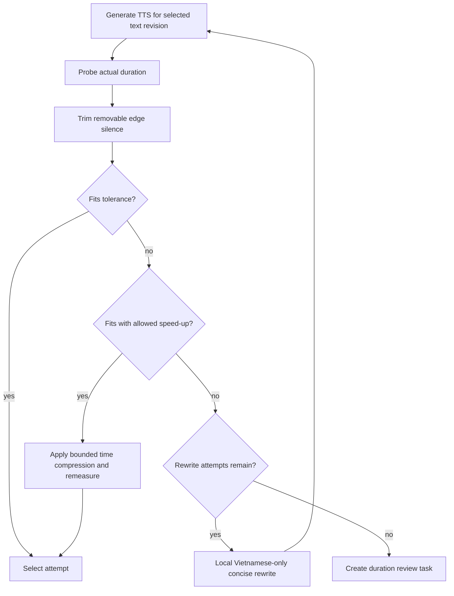

# Duration fitting

## Principle

Measured synthesized audio duration—not text length or model estimation—is authoritative. Repair is isolated to a subtitle segment and preserves every text/audio attempt.

## Policy

For segment `s`, the slot is `end_us - start_us`, optionally reduced by a configured padding policy. Let `measured_us` be duration obtained from ffprobe after synthesis and `trimmed_us` after conservative leading/trailing silence removal.

Proposed initial configuration for evaluation—not a final product promise:

- accept at or below slot plus 100 ms tolerance;
- trim only detected edge silence above conservative thresholds;
- allow at most 1.08× speech speed unless voice-quality evaluation approves more;
- allow at most two local rewrite attempts after the original synthesis;
- never truncate spoken content to fit.

All values are versioned policy settings and require listening tests before production approval.

## Attempt record

Each attempt records segment ID, attempt index, parent, input translation revision, text, provenance, TTS provider/model/voice and settings, raw/trimmed/final audio artifact IDs, measured durations, silence removed, speed factor, slot/tolerance, fit outcome, usage/cost, timestamps, and structured errors. It also publishes a versioned attempt-envelope artifact containing the candidate text and non-secret synthesis/measurement parameters, so both text and audio attempts have immutable artifact lineage in addition to transactional database records.

The local rewriter receives only the Vietnamese segment, selected tone policy and protected tone constraints, protected glossary terms/names, concise context needed to preserve meaning, the measured duration/target, previous rejected rewrites, and a strict output schema keyed by the segment ID. It must preserve the selected tone while shortening, and must not translate Chinese, edit timestamps, merge/split segments, change protected entities, invent humor/drama, or return audio.

## Decision invariants

- Synthesize and measure every candidate; never accept a rewrite on predicted length alone.
- Keep the original translation revision even when a shorter child revision is selected for speech.
- Use a new immutable artifact for trimmed or time-compressed audio.
- Reject empty, meaning-changing, glossary-breaking, or structurally invalid rewrites.
- Stop at configured attempt and cost limits. Exhaustion becomes `needs_review`, not an infinite retry.
- A user edit restarts fitting only for the changed segment and downstream render manifests.

## Failures

Runtime/provider errors follow bounded transient retry policy without consuming a semantic rewrite attempt. Invalid audio, unsupported format, non-finite samples, pathological silence/clipping, implausible duration, repeated deterministic synthesis failure, or unsafe speed transformation is permanent for that attempt and escalates according to policy. A generative TTS output that repeats, omits, or invents content is a content-integrity failure and must not be selected; automated heuristics may flag suspicious output, but they do not replace Vietnamese listening evaluation or scoped human review. If TTS succeeds but artifact publication is uncertain, reconcile by idempotency key before synthesizing again.

## Tests and evaluation

Unit-test boundary values for tolerance, silence, speed, attempts, and invalid durations. Contract-test audio formats, pinned model revisions, preset voice IDs, and voice settings. Use deterministic WAV fixtures for duration measurement and trimming. Maintain listening/evaluation samples covering rapid dialogue, names, punctuation, numbers, emotional speech, repetition/omission failures, and very short slots. Human approval is required before promoting a TTS model/voice or changing global speed or rewrite limits.
