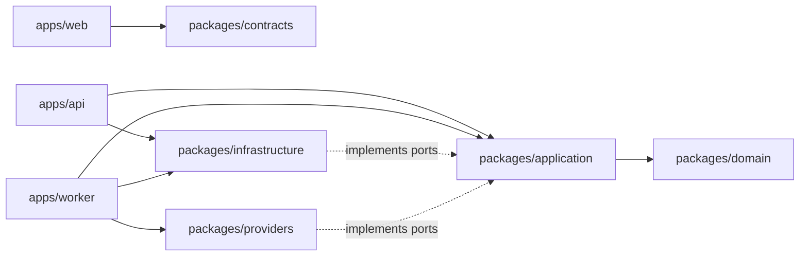

# Proposed repository structure

The architecture was approved on 2026-08-04. Phase 1 now contains the composition roots and package boundaries below; product modules and fixtures are added only in their authorized roadmap phase.

```text
.
├── apps/
│   ├── web/                       # Next.js editor and authenticated UI
│   ├── api/                       # FastAPI composition root and HTTP transport
│   └── worker/                    # Python worker entry points by queue profile
├── packages/
│   ├── domain/                    # Pure Python aggregates, policies, value objects
│   ├── application/               # Use cases, ports, commands, queries
│   ├── infrastructure/            # PostgreSQL, object store, Temporal, telemetry
│   ├── providers/                 # OCR, LLM, TTS, local rewrite, FFmpeg adapters
│   └── contracts/                 # Added when the first reviewed product API contract exists
├── db/
│   └── migrations/                # Added with the first approved application schema
├── tests/
│   ├── fixtures/media/            # Tiny deterministic, licensed/generated media
│   ├── fixtures/fonts/            # Reviewed subset/provenance for render parity tests
│   ├── contract/
│   ├── integration/
│   ├── workflow/
│   ├── e2e/
│   ├── security/
│   └── load/
├── deploy/                        # Local Compose topology and later deployment definitions
├── assets/
│   └── fonts/                     # Added with the approved font catalog in Phase 6
├── scripts/                       # Documented developer/operational scripts
├── docs/
│   └── adr/
├── .agents/skills/                # Repository-scoped Codex workflows
└── .github/                       # Review templates, dependency updates, and cost-free CI
```

## Deployable applications

`web`, `api`, and `worker` are deployable processes, not separate products or repositories. The worker application exposes multiple entry points from one codebase so deployments can assign independent concurrency and resources:

- `workflow`: Temporal workflows and lightweight orchestration activities;
- `media`: probe, proxy, extraction, and bounded audio transformations;
- `render`: final FFmpeg composition and output validation;
- `local-ai`: OCR, VieNeu-TTS synthesis, and narrowly scoped llama.cpp rewrite activities without provider credentials or internet egress;
- `translation`: global context extraction, semantic translation batches, and LLM-assisted consistency activities with the sole paid provider credential.

Queue profiles may later split further only when measured resource contention justifies it. Domain and application packages never import app entry points.

## Dependency direction



Domain code imports only the standard library and explicitly approved domain utilities. Application code depends on domain types and defines ports. Infrastructure and providers implement those ports. Composition roots select implementations.

## Package boundary rules

- Prefer a few cohesive packages over one package per entity or stage.
- Keep SQL models and repository implementations in `infrastructure`; do not leak them into domain APIs.
- Keep provider SDK payloads inside provider adapters.
- Keep tone prompt templates server-owned and versioned; expose preset identifiers through contracts, never raw system prompts.
- Keep the font catalog small and license-reviewed. Browser and renderer variants must derive from the same pinned font release.
- Generate the TypeScript client from the reviewed OpenAPI contract; do not maintain duplicate hand-written wire types.
- Keep test fixtures small, deterministic, legally usable, and described by provenance.
- Place scripts only when their command, inputs, safety behavior, and owner are documented.
