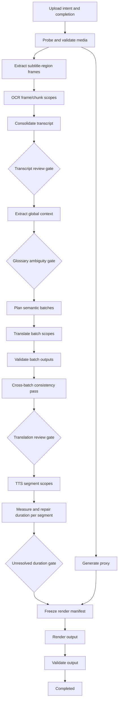

# Workflow and state model

## Model

Represent processing as a durable DAG of stage scopes rather than one giant status enum. Three related states answer different questions:

- **Project lifecycle:** `draft`, `active`, `completed`, `deletion_pending`, `deleted`.
- **Workflow status:** `pending`, `running`, `waiting_for_review`, `cancelling`, `completed`, `failed`, `cancelled`.
- **Stage execution status:** `pending`, `queued`, `running`, `retry_wait`, `succeeded`, `failed`, `cancel_requested`, `cancelled`, `needs_review`, `skipped`, `superseded`.

The API exposes a projection with current phase, percent/range, active review gates, failed scopes, and next actions. It never infers correctness from a single project status.

Upload ingress has its own state: `pending`, `uploading` (client-observed progress), `object_received`, `validating`, `accepted`, `rejected`, `expired`, or `aborted`. Only server verification can move an object from `object_received` to `accepted`; workflow processing starts from an accepted media asset.

## Stage graph



Review gates can be configured to auto-continue when no blocking findings exist. User edits create new revisions and selectively supersede downstream work.

## Stage contract

Every activity declares:

- scope key such as project, batch, segment, or render ID;
- exact input IDs and canonical input fingerprint;
- idempotency key and expected output kinds;
- hard and heartbeat/start-to-close timeouts;
- retry classification and maximum attempts;
- cancellation checkpoints and cleanup behavior;
- resource class and queue;
- progress unit;
- provider, model, prompt, and code version where relevant.

On start, the activity claims or loads the idempotency record. If a committed matching result exists, it returns it. Otherwise it records an attempt, works in a unique temporary directory, publishes immutable outputs, commits metadata, and cleans temporary files in `finally` behavior.

## Retry taxonomy

| Error class | Examples | Policy |
|---|---|---|
| Transient external | 429, 502/503, network reset | Exponential backoff with jitter, respect `Retry-After`, bounded attempts and elapsed time |
| Transient infrastructure | worker loss, object-store timeout, DB failover | Retry safely using heartbeat and idempotency checks |
| Resource pressure | temp disk full, out of memory, queue saturation | Do not hot-loop; reschedule on suitable queue or require operator review after bounded attempts |
| Invalid provider output | malformed JSON, missing IDs, truncation | One or two constrained repair/re-request attempts, then batch review; never accept partial silently |
| Invalid input/domain | corrupt media, impossible timing, unauthorized state transition | Permanent; create structured failure or review task |
| Policy/quota | duration/size limit, exhausted quota, cancelled project | No automatic retry until state changes |
| Deterministic defect | repeated same-code failure, invariant violation | Fail fast after duplicate signature threshold and alert; require fix/replay |

Defaults are stage-specific. Network calls use short connect and bounded response timeouts. Media operations derive upper bounds from duration/complexity and emit heartbeats. Workflows never retry indefinitely.

Errors use a stable envelope: `code`, `class`, `message_safe`, `retryable`, `provider_code`, `details_redacted`, `occurred_at`, and `cause_stage_execution_id`. Example code families include `AUTH_*`, `QUOTA_*`, `UPLOAD_*`, `MEDIA_*`, `STORAGE_*`, `OCR_*`, `PROVIDER_*`, `TRANSLATION_VALIDATION_*`, `TTS_*`, `DURATION_*`, `RENDER_*`, `CANCELLED`, and `INTERNAL_INVARIANT`. User-facing messages are mapped separately; raw exceptions and secrets are never persisted as safe messages.

## Idempotency and duplicate protection

Canonical key:

```text
stage-name / scope-id / input-fingerprint / policy-version
```

The fingerprint covers ordered input artifact checksums/revision IDs plus the translation-policy, subtitle-style, provider/model/prompt/settings relevant to that stage's output. A database uniqueness constraint prevents concurrent claims. Temporal workflow IDs prevent duplicate active project runs; signals carry client-generated request IDs and API mutation idempotency keys. Output object keys contain artifact IDs, never a shared overwrite target.

At-least-once activity execution is assumed. Exactly-once side effects are achieved only through provider idempotency support or application reconciliation.

## Recovery and partial restart

Temporal replays durable workflow history after process restarts. Activities heartbeat resumable cursors for chunked extraction/upload where useful. A restart command selects failed or invalidated scopes, computes downstream dependency invalidation, and creates a new workflow run linked to its parent. Successful compatible artifacts are reused by fingerprint.

Examples: retry one OCR chunk; retranslate one batch; regenerate TTS for one changed segment; rerender from an unchanged manifest. A transcript timing edit invalidates context/batches/TTS/render only where dependency analysis requires it; no global restart is automatic.

A project-wide tone change preserves upload/media/OCR/transcript and tone-neutral context, but supersedes old-policy translation executions and their TTS/duration/render descendants. The batch partition may be copied if its inputs remain compatible. Because translation is paid, the new policy is not admitted until the user confirms the estimated scope and quota is reserved. A subtitle-style change creates a new style version and invalidates only render manifests/outputs; HTML preview updates from structured state and no backend encode is scheduled until the user requests a render.

## Cancellation and cleanup

Cancellation changes the workflow to `cancelling`, prevents new expensive work, and requests cancellation of active activities. Activities check cancellation between safe units and heartbeat. Never terminate FFmpeg between publishing an object and committing its metadata; complete or discard the unique staging object first.

Committed immutable artifacts remain according to retention policy for resume/audit. Uncommitted multipart uploads, staging objects, and temp directories are cleaned immediately or by periodic sweepers. Cancellation is complete when active work has stopped and cleanup tasks are recorded, not necessarily when retained artifacts are deleted.

## Backpressure, fairness, and quotas

- Separate task queues for orchestration, media CPU, render, OCR/AI, and provider rate classes.
- Set worker concurrency from measured CPU, memory, temp disk, and vendor limits; render concurrency starts very low.
- Admit workflows only after per-user concurrent-project and estimated-cost quota reservation.
- Apply per-user fair scheduling/limits so one long video cannot consume all slots.
- Pause dequeue or reject new admission when queue age, storage, or provider error budgets exceed thresholds.
- Bound fan-out windows for OCR, translation, and TTS rather than enqueuing every segment at once.

## Progress

Progress is derived from weighted completed units and reported as a range when totals are not known. Persist stage counters and last heartbeat; publish lightweight notifications, but make polling the reliable fallback. Progress never advances solely because work was queued.
